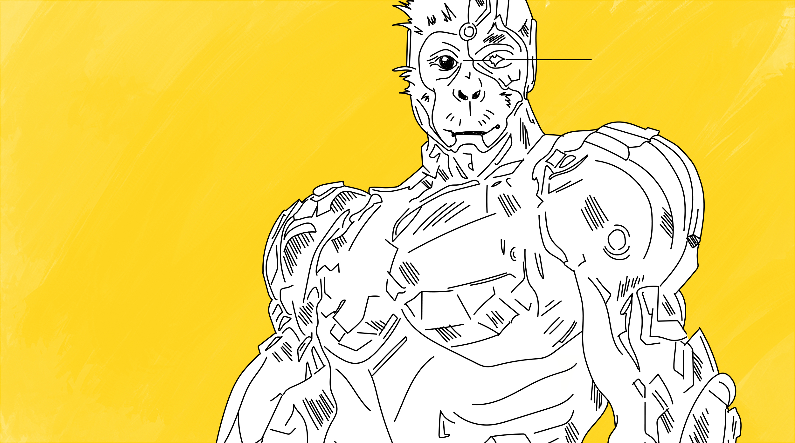
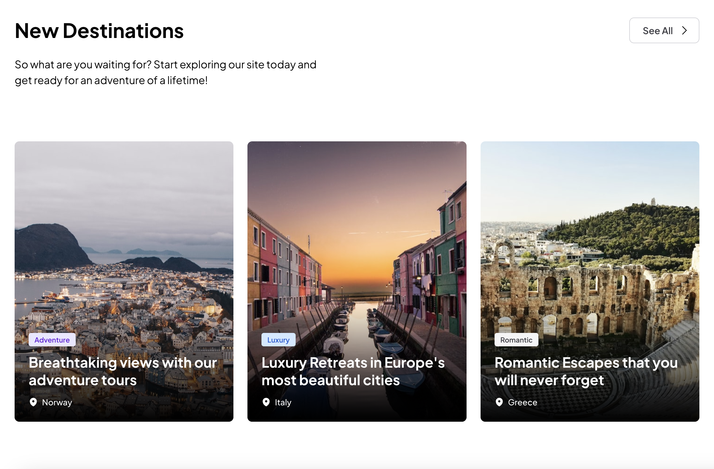
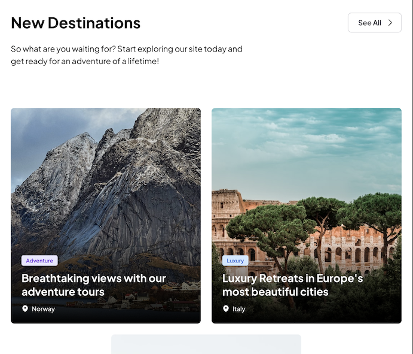
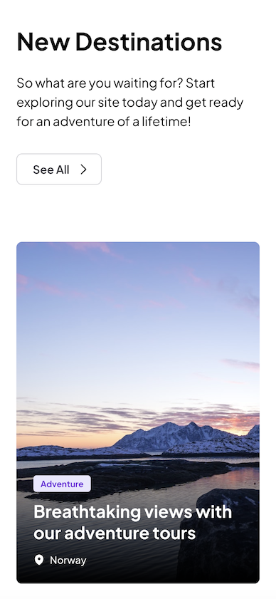

<!-- Readme top-->

<!-- Readme Header -->

	

 

  <h1><b>PRIMATE<b> - Test Task Project</h1>
  <h2>Welcome to the Primate's Test Task for Front End Developers!</h2>
  
Built with HTML, SCSS, JavaScript, Parcel, Mono & Figma Tokens

 

## Project Overview

This README provides an overview of this mini test project I completed for a Primate’s front-end web developer role. 

The project involved closely following a Figma design, utilising Mono and Figma tokens, and showcasing my problem-solving and initiative skills. The goal was to create a clean, maintainable, pixel-perfect demo that meets the team's requirements.

#
 
## Task Description

"Your task will focus on HTML and CSS (SCSS) and will involve working with the project structure and using GitHub. You will be assessed on your knowledge of working with design files.
The task is to add Call to action and listing components to the project. For the CTA component, you need to write semantic HTML structure along with CSS styles that match the provided designs. For the listing component, the HTML structure is already provided, so focus on the CSS styles and make changes only if necessary."

#

## Overview of Process & Workflow

Throughout the project, I followed a systematic workflow to ensure efficient development and adherence to the provided design:

** Understanding the Figma Design: **

I began by thoroughly studying the Figma design provided by the team. This allowed me to gain a comprehensive understanding of the visual requirements and UI components needed for the project. 

** Development Setup: ** 

I forked the repo, set up my development environment, including installing and updating necessary tools like node via nvm, installing Parcel and Mono, and organised the project directories to incorporate a common folder for shared styles such as media-queries and animations. I tried to provide quality commits through version control at each significant point and kept notes as I progressed.

** Initial CSS copy & refinement: **

To kickstart the design to development process, I initially copied the CSS styles from the Figma design . This served as a foundation for implementing the required styles in the code. 

I then started refining and refactoring the code so it was simpler, maintainable and easily understandable.  I noticed some additional styling and containers that weren’t really necessary when transferring to code and I also wanted to preserve the provided listing section's html structure as much as possible, as requested.  

I had to make a few decisions at these points to ensure I met the Figma design criteria without over-complicating the code as a result.  

** Mono Framework and Tokens: ** 

I utilised the Mono framework and Figma Tokens provided by the team to maintain consistency in styles, typography, and breakpoints. This helped streamline the development process and ensure adherence to the design system. I really enjoyed working with these tools and proved invaluable for increasing efficiency and consistency.  As a fan of Styled-Components library I appreciate the maintainability and scalability of working with tools like these.

** Semantic HTML & SCSS: ** 

I focused on writing clean, semantic HTML and tidy SCSS code, ensuring proper structuring and good organisation. I followed best practices to create maintainable and scalable stylesheets that are well thought out and easy to navigate.  I also followed accessibility guidelines, making use of aria-labels and tab-indexes within my index page.  

** JavaScript and Animations: ** 

I wanted to show some additional skills and some personality by incorporating simple JavaScript scripts and subtle animations to enhance the interactivity and user experience of the demo. This allowed for dynamic functionality and smooth transitions.

- Keydown/onClick script for the CTA button handling and accessibility.

- Scroll tracking script that tracks the users scroll position and adds an animate class to offer some gentle fade-in and scroll effects.

- An image pre-loader script that attempts to improve image loading time where no optimisation was available for randomly generated, served images.

** Refactoring & refining **

I made sure to spend time refactoring and removing any redundant code post responsive edits.  I cleaned up a lot of code so it was more organised and had less comments/clutter.  

#

  

#

## Challenges, Problem-solving & Initiative Skills

Throughout the task, I demonstrated strong problem-solving skills and took initiative to overcome challenges. Here are a few examples:

  ** Listing Section HTML Vs Figma Design **

  I had an issue where the brief required that I shouldn't change the sections html structure too much, if at all, but the Figma design had several more containers with a lot of styling so I had to decide which route to take.  

    - I noticed that the card content was split into separate divs so I tried that out first, but after some refactoring I actually achieved the same result without the need for the extra containers. 

    - I also decided that I wanted to retain the existing code as much as possible (as requested) for the sake of simplicity and readability, I did however make the decision to wrap the card content within the card__media div, which allowed the easiest route to achieving the text content to overlay the images.

    - my design matches that of the brief and has less code overall, it's easier to understand and more maintainable. I felt it was the right decision to make.

  ** Font Size Error: ** 

  While incorporating the "label xs" typography, I received an error within Parcel, where the font size was smaller than the default base font size and was displaying null as a result. 
  
    - To overcome this, I attempted to modify the Mono configuration file to accommodate the smaller font size and ensure correct rendering and also checked the token.json and token.scss files for errors. In the end I manually added the font-size to the element styling but in the future I could learn how to develop my own custom Mono configs and would enjoy providing proper solutions to issues like this when they crop up.

  ** Responsive Design: ** 
  
  I ensured that the demo is fully responsive by implementing organised media queries to adjust layout and styles for different screen sizes. This required careful consideration of breakpoints utilising Mono and Tokens SCSS templates, I had a go at creating custom breakpoints, accessed via a 'map-get' and added some fluid typography to deliver a consistent experience across devices.

    - One challenge I faced was reducing the gap between cards in the listing section whilst still matching the figma design padding, whilst keeping it pixel perfect on responsive modes. I analysed my existing code and made adjustments to the width calculation and the padding styles to achieve the desired gap size that matched the outer container padding. By taking the initiative to modify the original CSS at breakpoints, I successfully achieved a clean responsive layout with a smaller gap that matched the Figma design.

#

## Responsive Screenshots

Below are screenshots of the project, showcasing the pixel-perfect design and responsiveness:

#

## Final Thoughts

In conclusion, I really enjoyed completing this project! It provided an excellent opportunity to showcase some of my skills as a front-end web developer. By closely following the Figma design, utilising the Mono framework and Tokens, and demonstrating problem-solving and initiative skills, I created a clean, maintainable, and pixel-perfect demo that hopefully meets the team's expectations.  If I'd had more time I would of utilised Mono slots and really spent more time learning it, I would of also been able to translate all the figma spacing etc but I would endeavor to learn the framework inside out in future.

I am confident that my attention to detail, dedication to clean code, and ability to overcome challenges make me an excellent fit for the front-end web developer role.

If you have any questions or would like to explore the project further, please feel free to reach out. Thank you for considering my application!
